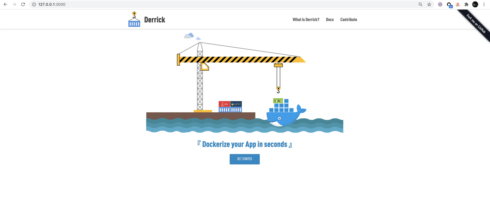
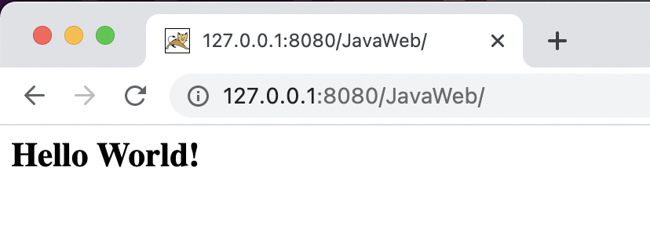

# Derrick

[](https://www.apache.org/licenses/LICENSE-2.0.html)
[](https://github.com/alibaba/derrick/releases)
[](https://travis-ci.org/alibaba/derrick)
[](https://codecov.io/gh/alibaba/derrick)

Derrick is a tool to help you containerize application in seconds.
Derrick focuses on developer workflow in local development environment.
Derrick will inspect your workspace and generate Dockerfile and other manifests to achieve containerization.
You can use Derrick to set up your DevOps processes in container-native way.

    

Using Derrick is very simple:    
1. `derrick gen` to automatically inspect the workspace and generate the Dockerfile for your application, or
2. `derrick list` to show all available riggings and pick one via `derrick gen -r <rigging>` to generate the Dockerfile.
3. Use your favorite text editor to modify the Dockerfile or other manifests before building and shipping the containers.
4. Integrate into your workflow and have fun.

## Language Support

Java, Golang, NodeJs, Python, PHP.      

## Framework and Build tool Support

Here is the list of frameworks passed the tests.If you want more frameworks or can not dockerize application,please submit a issue.
* Java (maven)
  * springcloud
  * springboot
* PHP (composer)
  * Laravel
  * Lumen
  * ThinkPHP
  * Symfony
* PYTHON (pip or setup)
  * flask
  * Django
* Golang (tools by vendor)
  * Gin
  * Beego
* NodeJs (npm)
  * Express
  * Sails
  
## Quick Start

### Installation

Build `derrick` binary: 

```shell
make build
cp _bin/derrick /usr/local/bin/
```

Verify it in command line:

```shell
$ derrick -h
🐳 A tool to help you containerize application in seconds

Usage:
  derrick [command]

Available Commands:
  help        Help about any command
  init        Detect application's platform and compile the application
  up          Build an image for your application
  version     Prints out build version information

Flags:
  -h, --help   help for derrick

Use "derrick [command] --help" for more information about a command.
```

### Build golang application

- Clone a sample project

Clone this sample project into your Golang path.

```shell
$ git clone git@github.com:zzxwill/golang-web-application.git
$ cd golang-web-application
```

- Compile the application

```shell
$ derrick init
? Please input image name with tag (such as "registry.com/user/repo:tag"):  zzxwill/golang-web-application:latest
Successfully detected your platform is Golang and compiled it successfully.
```

- Push the image and deploy it to Kubernetes

```shell
$ derrick up -k
#1 [internal] load .dockerignore
#1 sha256:daa4b49e67a2b1678515c23e671c4892e448407d9879e991a96e123d9e26bc08
#1 transferring context: 34B done
#1 DONE 0.0s
...
The application image zzxwill/golang-web-application:latest has been successfully built.
The push refers to repository [docker.io/zzxwill/golang-web-application]
eb5e68ae951b: Preparing
5a91cd45462f: Preparing
c04d1437198b: Preparing
5a91cd45462f: Layer already exists
c04d1437198b: Layer already exists
eb5e68ae951b: Layer already exists
latest: digest: sha256:dbf02a8fccfaab2bdf901e18d3244ef3121108c8bea6dfaaa6429bf3693bd93b size: 946
service/golang-web-application unchanged
deployment.apps/golang-web-application unchanged
Your application has been built and deployed to your Kubernetes cluster! You can run `kubectl get svc` to get exposed ports.
```

`derrick up` will just build and push the image.

- Visit the application

```shell
$ kubectl port-forward service/golang-web-application 8080:8080
Forwarding from 127.0.0.1:8080 -> 8080
Forwarding from [::1]:8080 -> 8080
Handling connection for 8080
Handling connection for 8080
```

```shell
$ curl 127.0.0.1:8080/Derrick
Hi there, I love Derrick!
$ curl 127.0.0.1:8080/Golang
Hi there, I love Golang!
```

### Build NodeJS application

```shell
$ git clone git@github.com:zzxwill/nodejs-web-application.git

$ cd nodejs-web-application

$ derrick init
? Please input image name with tag (such as "registry.com/user/repo:tag"):  zzxwill/nodejs-web-application:latest
Successfully detected your platform is NodeJS and compiled it successfully.

$ derrick up -k
#2 [internal] load build definition from Dockerfile
#2 sha256:f3e51f771f9872e1cf625598754043730963fd48aff6936dc49dbdbafc2fb09d
#2 transferring dockerfile: 535B done
#2 DONE 0.0s
...
441ff7cb3d60: Pushed
latest: digest: sha256:51f2cb069b04a74bf0da33b65d9a3b99be47a1334c50be05078ead3049c077c0 size: 2834
service/derrick-nodejs-demo created
deployment.apps/derrick-nodejs-demo created
Your application has been built and deployed to your Kubernetes cluster! You can run `kubectl get svc` to get exposed ports.

$ kubectl port-forward service/derrick-nodejs-demo 3000:3000
Forwarding from 127.0.0.1:3000 -> 3000
Forwarding from [::1]:3000 -> 3000
Handling connection for 3000
Handling connection for 3000
.dockerignore
Handling connection for 3000
Handling connection for 3000
```



### Build Java application

Clone a Java application, and build it.

```shell
$ git clone git@github.com:zzxwill/java-maven-web-application.git
$ cd java-maven-web-application
$ derrick init
  ? Please input image name with tag (such as "registry.com/user/repo:tag"):  zzxwill/java-maven-web-application:latest
  Successfully detected your platform is Maven and compiled it successfully.
$ derrick up -k
  #1 [internal] load .dockerignore
  #1 sha256:6204ab6bc23d3b5044b63044856c095e175d5acb3c612c0625c67404b7d7358e
  #1 transferring context: 2B 0.0s done
  #1 DONE 0.0s
  #10 [build-env 4/4] RUN mvn package
  #10 sha256:cddfe94c971d47d10b23ebc6ecb148c9f463968497b65ac8247986e10fbfa699
  #10 2.961 [INFO] Scanning for projects...
  #10 3.133 [INFO]
  #10 3.133 [INFO] --------------------------< JavaWeb:JavaWeb >---------------------------
  #10 3.146 [INFO] Building JavaWeb Maven Webapp 0.0.1-SNAPSHOT
  #10 3.156 [INFO] --------------------------------[ war ]---------------------------------
  #10 3.716 Downloading from central: https://repo.maven.apache.org/maven2/org/apache/maven/plugins/maven-resources-plugin/2.6/maven-resources-plugin-2.6.pom
  Downloaded from central: https://repo.maven.apache.org/maven2/org/apache/maven/plugins/maven-resources-plugin/2.6/maven-resources-plugin-2.6.pom (8.1 kB at 3.9 kB/s)
  #10 5.852 Downloading from central: https://repo.maven.apache.org/maven2/org/apache/maven/plugins/maven-plugins/23/maven-plugins-23.pom
  Downloaded from central: https://repo.maven.apache.org/maven2/org/apache/maven/plugins/maven-plugins/23/maven-plugins-23.pom (9.2 kB at 15 kB/s)
  #10 6.484 Downloading from central: https://repo.maven.apache.org/maven2/org/apache/maven/maven-parent/22/maven-parent-22.pom
  ...
  0c3170905795: Mounted from library/tomcat
  latest: digest: sha256:242aa751a36310adbd6fc1af39dad06b974547bfadb8e6698d20edba2841989f size: 1782
  service/java-maven-web-application created
  deployment.apps/java-maven-web-application created
  Your application has been built and deployed to your Kubernetes cluster! You can run `kubectl get svc` to get exposed ports.
```

Visit the application.

```shell
$ kubectl get svc
NAME                         TYPE        CLUSTER-IP     EXTERNAL-IP   PORT(S)          AGE
java-maven-web-application   NodePort    172.21.6.80    <none>        8080:32168/TCP   29s

$ kubectl port-forward svc/java-maven-web-application 8080:8080
Forwarding from 127.0.0.1:8080 -> 8080
Forwarding from [::1]:8080 -> 8080
```




## *License*

This software is released under the Apache 2.0 license.
