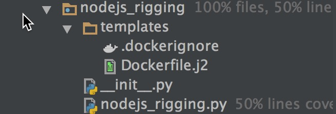
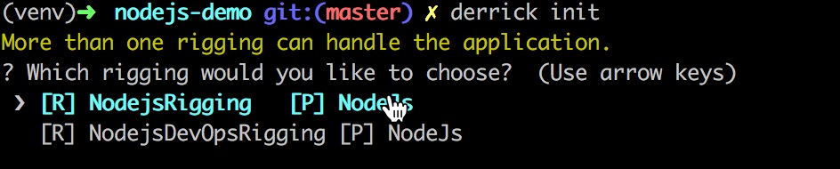

### 简介 
   
<b>Derrick</b> 是一个帮助应用Docker化的工具，通过探测、编译、构建，自动生成Dockerfile，快速在本地验证容器化后的业务正常与否。
### 快速开始   
#### 安装Derrick
```
	pip install derrick
	
	注：开源前暂无法使用，请使用源码安装 python setup.py install 
```
#### 使用示例项目  
下面以一个Node.Js项目为例，演示Derrick的使用方法。
##### 下载demo项目
```
	git clone git@gitlab.alibaba-inc.com:zhongwei.lzw/nodejs-demo.git 
```
##### 运行Derrick   
```
	derrick init 
	
	运行结果如下   
	
    8888888b.                       d8b        888
    888  "Y88b                      Y8P        888
    888    888                                 888
    888    888 .d88b. 888d888888d888888 .d8888b888  888
    888    888d8P  Y8b888P"  888P"  888d88P"   888 .88P
    888    88888888888888    888    888888     888888K
    888  .d88PY8b.    888    888    888Y88b.   888 "88b
    8888888P"  "Y8888 888    888    888 "Y8888P888  888

    ===================================================
    Derrick is a scaffold tool to migrate applications
    You can use Derrick to migrate your project simply.
    ===================================================

	This is the first time to run Derrick.

	Successfully create DERRICK_HOME in /Users/zhongweilzw/.derrick
	Derrick detect your platform is NodeJs and compile successfully.
```
初次运行Derrick的时候会创建在当前用户的根路径下创建.derrick目录，里面会保存用户未来定义的插件、Rigging等等。     

此时会发现在项目的目录中已经可以看到探测生成的Dockerfile。      

```
	derrick build 
	
	运行结果： 
	Sending build context to Docker daemon  32.77kB
	Step 1/14 : FROM node:6 AS base
 	---> cb4fff641acf
	Step 2/14 : WORKDIR /app
 	---> Using cache
 	---> 02b898c5e4e2
	Step 3/14 : COPY package.json .
 	---> Using cache
 	---> 908c48134d94
	Step 4/14 : RUN npm set progress=false && npm config set depth 0
 	---> Using cache
 	---> 656bd3e3d0c6
	Step 5/14 : RUN npm install --only=production
 	---> Using cache
 	---> 4499d1526017
	Step 6/14 : RUN cp -R node_modules prod_node_modules
 	---> Using cache
 	---> b2062d2a27bf
	Step 7/14 : RUN npm install
	
	... ... 
	... ... 
	
	npm info ok
	Successfully built 64ee04137bd5
	Successfully tagged nodejs-demo:latest
	Build nodejs-demo:latest successfully.
	You can execute `docker run [options]` to run this image.
```
此时一个镜像已经构建完成，在本地进行镜像的验证即可。      

### 进阶用法 
#### 安装自定义Rigging   
```
	pip install --target=~/.derrick/rigging rigging_package_name   
	
	# 也可以拷贝Rigging到~/.derrick/rigging目录   
```

### 成为代码贡献者
#### Derrick的原理    
了解`Derrick`是如何将代码转换成Dockerfile会帮助你更好的hack `Derrick`。`Derrick`的实现原理主要来自CloudFoundry中buildpack，如果想进一步了解buildpack原理的开发者可以查看<a href="https://docs.cloudfoundry.org/buildpacks/understand-buildpacks.html" target="_blank">这篇文章</a>。在此，我们简单的介绍下buildpack的核心概念。一个服务能够运行起来到底需要哪些必要的因素，抽象后大体可以分为三类：代码，应用配置，应用依赖（基础环境、运行依赖）。buildpack要解决的问题就是如何将代码通过一些流程转变为一个运行的应用的过程。在CloudFoundry中buildpack是一系列脚本的集合，通常一个buildpack会包含三个脚本，detect,compile,release.当代码提交给CloudFoundry后，会依次执行三个脚本，然后尝试通过脚本执行将代码转变为一个运行的服务。detect脚本的主要作用是探测当前的buildpack是否能够处理你的代码，如果能够处理就会运行compile来进行代码特征的探测，通常探测的方式包含包管理配置探测、自定义配置探测等等。例如一个nodejs的应用，在compile的时候会探测package.json中的一些配置，来判断当前nodejs的语言版本，启动的命令，是否依赖系统的包等等。当compile脚本执行完成后，会调用release脚本，这个脚本的主要作用是描述如何启动当前的应用，类似启动脚本。通过这三个命令CloudFoundry会尝试将代码转换为运行的服务。    

通过上面的介绍大家不难发现buildpack是有一些局限的，因为很多特性信息包括配置都无法通过探测的方式得到。诚然，buildpack只能解决通用场景的80%左右的问题，因此CloudFoundry作为一个PaaS平台会预定义一些项目的template，只有满足的template的项目才能够正常的buildpack，而且CloudFoundry支持自定义builpack，通过这种方式让开发者能够解决自己特征性的需求。     

那么Derrick是如何借鉴buildpack的机制呢？CloudFoundry的目标是生成运行的服务，而Derrick的目标是生成一个可运行的镜像的Dockerfile，因此Derrick中需要的是buildpack机制中的detect与compile，而release对应的运行能力其实并不是Derrick所需要的。因此Derrick会先通过detect的方式探测是否可以处理当前的语言或者框架，如果可以处理，那么会调用compile，进行Dockerfile的生成。

#### Derrick中的核心概念 
Derrick中有几个核心的名词概念，了解了他们的具体的含义有助于大家进一步理解Derrick的实现原理。     
##### Rigging

  
Derrick的本意是起重机的意思，在码头上Derrick是用来吊Container（集装箱）的。而绑定Container（集装箱）的Rigging（绳索）。吊起不同的Container需要使用不同的Rigging。Derrick探测、编译不同的语言与框架也就需要不同的Rigging。因此，在Derrick中转换不同语言或者平台的角色就是Rigging。比如NodeJs的平台，就有对应的NodejsRigging,Maven的项目就会有MavenRigging。Rigging是buildpack在Derrick中的一种实现。

##### Command
Command 顾名思义是命令的意思，在Derrick中内置了init、build两条命令，init命令会执行整个Rigging的流程，build命令会根据生成的Dockerfile完成docker image的构建。    

##### Detector    
Detector是探测器的意思，Rigging中有很大一部分功能是需要探测源代码的结构、配置等等信息。为了能够让探测的流程可以复用，并且使用更加简单，我们提出了Detector的概念，开发者可以使用已定义的Detector或者自定义Detector快速的开发自己的Rigging。


#### 如何开发一个Rigging  
在开发Rigging之前，我们来看下Derrick init命令是如何使用Rigging来完成相关信息生成的。Rigging分为两种，一种是内置的Rigging，一种是用户自定义的Rigging。Derrick支持开发者以插件的方式运行Rigging，在Derrick中Rigging的加载是通过RiggingManager进行管理的，RiggingManager会管理所有的Rigging的加载、运行的生命周期。Derrick init命令执行的时候会通过RiggingManager获取所有系统中注册的Rigging，并依次调用Rigging的detect方法来判断当前的Rigging是否可以处理当前的语言或者平台，如果能处理那么就会进行标记，当所有的Rigging遍历完成后，如果有标记的Rigging数目大于一个，那么开发者可以选择调用哪个Rigging进行后续的compile。如果只有一个Rigging，那么会直接调用当前Rigging的compile。如果没有Rigging进行标注，那么会提示无法处理当前语言和平台。       

##### 一个Rigging的标准结构    
Rigging也是一个标准的Python module，是可以通过pip进行安装的，因此一个Rigging的标准结构如下：

    

在nodejs_rigging.py中的内容如下    

```
#! /usr/bin/env python
# -*- coding: utf-8 -*-

from __future__ import absolute_import, division, print_function

import os

from derrick.core.detector_report import DetectorReport
from derrick.core.rigging import Rigging
from derrick.detectors.image.node import NodeVersionDetector

PLATFORM = "NodeJs"


class NodejsRigging(Rigging):
    def detect(self, context):
        """
        :param context:
        :return: handled(bool),platform(string)
        """
        workspace = context.get("WORKSPACE")
        package_json_file = os.path.join(workspace, "package.json")
        if os.path.exists(package_json_file) is True:
            return True, PLATFORM
        return False, None

    def compile(self, context):
        dr = DetectorReport()
        docker_node = dr.create_node("Dockerfile.j2")
        docker_node.register_detector(NodeVersionDetector())
        return dr.generate_report()

```
首先Rigging必须继承自derrick.core.rigging.Rigging或者它的子类，每个Rigging需要实现两个方法，一个是detect方法，一个是compile方法。

detect方法返回的结果为handled(bool),platform(string)，handled表示当前的Rigging是否能够处理探测的语言或者框架，platform表示探测出来的内容，这个信息会在又多个探测器选择的时候或者探测完成显示的时候显示出来。     


compile方法核心的目标是进行探测并生成相应的文件，换言之，compile的核心目标是如何生成渲染模板的变量。

```
Dockerfile.j2中的内容    

# stage1
FROM {{ version }} AS base
WORKDIR /app
COPY package.json .
RUN npm set progress=false && npm config set depth 0
RUN npm install --only=production
RUN cp -R node_modules prod_node_modules
RUN npm install

# stage 2
FROM base As test
COPY . /app
RUN npm test

# stage 3
FROM base AS release
COPY --from=base /app/prod_node_modules /app/node_modules
COPY . /app
CMD ["npm","start"]
```
例如在本例中compile的目标就是如何生成Dockerfile.j2中所需的version变量。Derrick为了简化开发者开发，compile只需要返回模板节点的配置信息即可，Derrick会完成模板剩余的渲染动作。例如本例中compile最终只需要返回一个python的dict即可。

```
例如：
{
	"Dockerfile.j2":{
		"version":"node:6"
	}
}
```
那么在上面代码中的DetectorReport的作用是什么呢，为什么不使用简单的dict的操作，而是额外定义了DetectorReport来进行dict的生成。DetectorReport的目的是简化大家的开发，在本例中我们需要的变量只有version，因此整体的代码可以写的非常简单，但是在实际的Rigging编写中我们会探测非常多的信息，需要依赖很多detector才能完成，那么如何组织这样的dict生成就变得比较复杂了。此外如果基于已有的Rigging进行开发新的Rigging如何复用上层的探测结果也会成为一个难以解决的问题。那么DetectorReport是如何解决的呢，DetectorReport实际上是一个dict的解析与反解析的树结构定义。

		dr = DetectorReport()    //构建了一个特定的数据report
        docker_node = dr.create_node("Dockerfile.j2") //创建了一个Dockerfile.j2节点
        docker_node.register_detector(NodeVersionDetector()) //将探测的结果扩展到这个节点上
        return dr.generate_report()  //遍历DetectorReport树并生成dict    

最后我们再看下NodeVersionDetector是如何实现探测的     

```
#! /usr/bin/env python
# -*- coding: utf-8 -*-

from __future__ import absolute_import, division, print_function

import subprocess

from derrick.core.detector import Detector
from derrick.core.logger import Logger

NODEJS_4 = "node:4"
NODEJS_6 = "node:6"
NODEJS_8 = "node:8"
NODEJS_LATEST = "node:latest"


class NodeVersionDetector(Detector):
    def execute(self):
        output = subprocess.check_output(["node", "--version"], shell=False)
        version = NodeVersionDetector.get_most_relative_version(output)
        return {"version": version}

    @staticmethod
    def get_most_relative_version(version):
        version_num = str(version)[1:]
        version_arr = version_num.split(".")

        detect_version = NODEJS_LATEST
        try:
            base_version = version_arr[0]
            if base_version == "4":
                detect_version = NODEJS_4
            if base_version == "6":
                detect_version = NODEJS_6
            if base_version == "8":
                detect_version = NODEJS_8
        except Exception as e:
            Logger.debug("system version is %s,error message is %s" % (version, e.message))
        return detect_version

```
NodeVersionDetector 实现了Detector的execute方法，并返回一个dict。而这个dict最终会在DetectorReport遍历生成dict的时候自动扩展到相应的节点上。      


##### 如何开发一个自定义Rigging   
例如我们要开发一个nodejs_devops_rigging,因为已经内置了NodejsRigging,我们可以扩展自已有的Rigging    

   
根据上面介绍的部分创建目录结构，在nodejs_devops_rigging.py中内容如下   

```
#! /usr/bin/env python
# -*- coding: utf-8 -*-

from __future__ import absolute_import, division, print_function

from derrick.core.detector import Detector
from derrick.core.detector_report import DetectorReport
from derrick.rigging.nodejs_rigging.nodejs_rigging import NodejsRigging
from whaaaaat import prompt


class NodejsDevOpsRigging(NodejsRigging):
    def compile(self, context):
        report = super(NodejsDevOpsRigging, self).compile(context)
        dr = DetectorReport()
        dr.parse_report(report)
        dockerfile_node = dr.create_node("docker-compose.yml.j2")
        dockerfile_node.register_detector(DockerComposeDetector(), context)
        print(dr.generate_report())
        return dr.generate_report()


class DockerComposeDetector(Detector):
    def execute(self, *args, **kwargs):
        questions = [
            {
                'type': 'input',
                'name': 'image',
                'message': 'What\'s your image repo ',
            },
            {
                'type': 'input',
                'name': 'ports',
                'message': 'What\'s your application ports',
            }
        ]
        answers = prompt(questions)
        return answers

```
NodejsDevOpsRigging 继承自NodejsRigging 复用了NodejsRigging 的 detect方法。在覆写的compile方法中

```
  	def compile(self, context):
  		# 调用父类的方法生成dict
        report = super(NodejsDevOpsRigging, self).compile(context)   
        # 构建自己的report对象
        dr = DetectorReport()
        # 将父类生成的dict反解析成为DetectorReport树
        dr.parse_report(report)
        # 创建新的模板节点
        dockerfile_node = dr.create_node("docker-compose.yml.j2")
        # 为这个节点注册新的DockerComposeDetector
        dockerfile_node.register_detector(DockerComposeDetector(), context)
        # 重新生成dict
        return dr.generate_report()

```

在下面也定义了DockerComposeDetector      

```
class DockerComposeDetector(Detector):
    def execute(self, *args, **kwargs):
        questions = [
            {
                'type': 'input',
                'name': 'image',
                'message': 'What\'s your image repo ',
            },
            {
                'type': 'input',
                'name': 'ports',
                'message': 'What\'s your application ports',
            }
        ]
        # 通过交互式的方式可以获得探测的结果
        answers = prompt(questions)
        return answers
```
这样一个基于NodejsRigging二次开发的NodejsDevOpsRigging就开发完成了，下面我们进行验证，将这个目录拷贝到
~/.derrick/rigging目录中。然后在需要探测的项目中执行 Derrick init   
     

通过方向键选择即可。


<p style="color:red">注意：<br/>   
① Python默认情况下是不打包非.py的文件的，因此在调试的时候需要将代码提交到本地，在setup.py中会自动将SCM控制的文件一同打包。<br/><br/>
② 调试代码的时候，如果已经安装过Derrick会自动先寻找系统中安装的Derrick，因此最好在调试Derrick代码的时候，卸载已经安装的Derrick。
</p>

   
